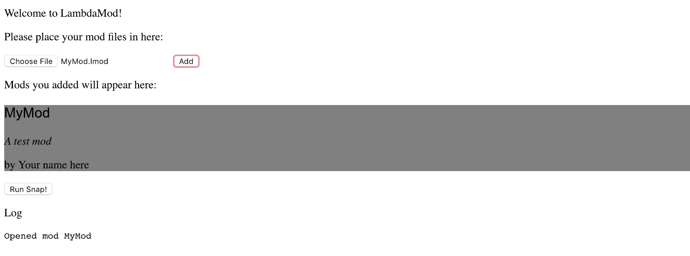
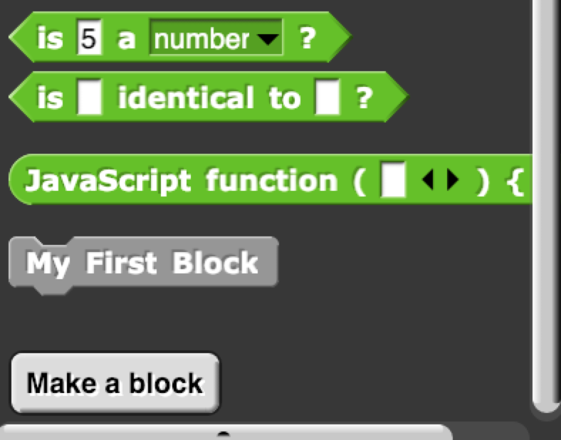
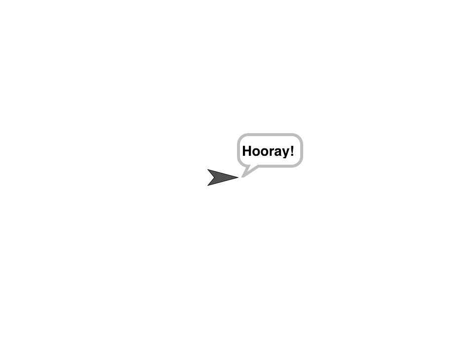
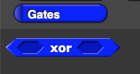

#LambdaMod
A mod loader for Snap_!_

--
##Things that will come in handy
* Knowledge of Javascript
* An understanding of the Snap_!_ source code

That's pretty much it! On to the coding!

##Making your first mod
To start making your mod, all you have to do is open your favo(u)rite text editor. A more user-friendly editor is still on the drawing board, but you can program mods using raw Javascript. To start off, add a comment at the beginning of your program. It should look like this:

```
//MyMod`A test mod`Your name here
```
This is the metadata of the mod. The comment is in this format:

`//` The mod name `` ` `` The description `` ` `` The author's name

Now save your mod as `MyMod.lmod`.

Go to the [LamdaMod Loader](https://chocolatecircus445.github.io/LambdaMod/ "Link to the loader"), upload your file, and click the "Add" button.

The loader should now look like this:



Notice the gray box with the mod information. If this shows something different, contact me with your comment.

Onto the next topic!

##Adding blocks

This is an important aspect of LambdaMod. If you're sick of using blocks to program your code, this is for you. 

To add a block, you must first declare a variable. We'll call it "myBlock". Add the following to your code:

```javascript
var myBlock;
```

But what do we do with this? We turn it into a block! How? By using the `Block` object!

```javascript
var myBlock = new Block();
```

How does LambdaMod tell what block to make? We add inputs, of course! Here are the inputs:

**name**

The id of the block, in this case, it will be `myBlock`.

**only**

This controls whether this is only for the stage, sprites, or both.

**type**

This controls what kind of block it is, a command, a reporter, or a predicate/Boolean.

**category**

This determines what category color the block will be. Let's put it in "other" for now.

**spec**

Ah, the face of the block, and the most important input. You can just put plain text in here, or use percent codes to add input morphs. (More on those later).

**pcat**

This is the category where the block will show up. We're setting it to "operators".

Ok, that covers most of them, so let's get coding!

Let's label the block "My First Block". We can do that by setting `spec` to `'My First Block'`. But what about all of the other inputs? Here they are.

```javascript
var myBlock = new Block('myBlock', 'both', 'command',
'other', 'My First Block', 'operators');
```

If you think that's too weird of an object declaration, you can always do this:

```javascript
var myBlock = new Block();
myBlock.name = 'myBlock';
myBlock.only = 'both';
myBlock.type = 'command';
myBlock.category = 'other';
myBlock.spec = 'My First Block';
myBlock.pcat = 'operators';
```

For the final step, you must add:

```javascript
thisMod.blocks.push(myBlock);
```

This tells LambdaMod to add your block to Snap_!_

Without it, it wouldn't show up.

Here is what your finished code should look like:

```javascript
//MyMod`A test mod`Your name here

var myBlock = new Block('myBlock', 'both', 'command',
'other', 'My First Block', 'operators');

thisMod.blocks.push(myBlock);
```

Save the file, reload the LambdaMod Loader, and load it into the LambdaMod Loader.

After you're done, click the big "Run Snap!" button. You should see text appear in the log section. That's just LambdaMod telling you the status of your mod loading into Snap_!_

When you're done, head over to the "Operators" category and scroll to the very bottom.

You should see your very own block!



What happens when you click it? Well...nothing. Pretty anti-climactic, right? That's because it hasn't been programmed to do anything.

Luckily, we can fix that!

Go back to your text editor, and set `only` to `sprite`. We're going to make the sprite say, "Hooray!"

```javascript
myBlock.func = function() {
	var sprite = this.mySprite(); //Gets the sprite that is calling our block.
  	sprite.bubble("Hooray!", false, false); //Makes the sprite say, "Hooray!"
  	setTimeout(function() {
    	sprite.stopTalking();
  	}, 2000); //Waits 2 seconds for the sprite to stop talking.
}
```
Your code should now look like this:

```javascript
//MyMod`A test mod`Your name here

var myBlock = new Block('myBlock', 'sprite', 'command',
'other', 'My First Block', 'operators');
myBlock.func = function() {
  var sprite = this.mySprite(); //Gets the sprite that is calling our block.
  sprite.bubble("Hooray!", false, false); //Makes the sprite say, "Hooray!"
  setTimeout(function() {
    sprite.stopTalking();
  }, 2000); //Waits 2 seconds for the sprite to stop talking.
}

thisMod.blocks.push(myBlock);
```
Save your code, reload the LambdaMod Loader, open your file, and run Snap_!_

Grab your block, drag it into your scripts, and click it. A talk bubble should appear saying, "Hooray!"



Hooray, indeed. You have just made your first LamdaMod mod.

##Adding inputs

What if we want our sprite to stop talking after a variable period of seconds? We can do that! We just need to add an input.

First, change `spec` to `'My First Block | stop talking after %n seconds'`

That `%n` is a percent code. Percent codes are what go in the `spec` attribute to declare inputs. This one is a number input. But we need to plug in the input to the function. Let's do that right now:

```javascript
myBlock.func = function(stop) {
  var sprite = this.mySprite(); //Gets the sprite that is calling our block.
  sprite.bubble("Hooray!", false, false); //Makes the sprite say, "Hooray!"
  setTimeout(function() {
    sprite.stopTalking();
  }, 2000); //Waits 2 seconds for the sprite to stop talking.
}
```
It doesn't look like it's doing anything in there, so let's plug it into the `setTimeout` block.

```javascript
myBlock.func = function(stop) {
  var sprite = this.mySprite(); //Gets the sprite that is calling our block.
  sprite.bubble("Hooray!", false, false); //Makes the sprite say, "Hooray!"
  setTimeout(function() {
    sprite.stopTalking();
  }, stop * 1000); //Waits in milliseconds, so we must multiply by 1000.
}
```

Now save, reload, load, the usual.

Click "Run Snap_!_ "

You should see this:


But do you see how on the "say x for y seconds" block, y automatically becomes 2? We can do that, too. Go back to your code, and add this argument to myBlock:

```javascript
var myBlock = new Block('myBlock', 'sprite', 'command', 'other', 
'My First Block | stop talking after %n seconds', 'operators', [2]);
//Must be an array in case there are other inputs.
```

Now `stop` should default to 2.

Save, reload, load, add mod, run Snap_!_, same process.

Now pull out a copy of your block. The input field should default to 2.

That's all for this section! Here are the input morphs and their percent codes:

* Object: %obj
* Text: %txt
* List: %l
* Number: %n
* Any: %s
* Boolean/Predicate: %b
* Command (ring): %cmdRing
* Reporter (ring): %repRing
* Predicate (ring): %predRing
* Command: %c
* Colo(u)r: %clr
* Code: %code
* Input list: %inputs
* Line break: %br
* Upvar: %upvar

To have multiple inputs, add `%mult` right before your percent code. For example, if you wanted to have a list of numbers, you would use `%mult%n`.

##Working with Categories (and Gates)

In this section, we will be creating a new mod that adds a new category into Snap_!_, and some logic gates.

First, create a new mod called "LogicGates.lmod".

Once you have done that, add the metadata.

``//Logic Gates`Adds logic gates into Snap!`Your name``

Let's create an XOR (Exclusive OR) gate. Here is the truth table for it:

<table>
	<tr>
		<td><b>A</b></td>
		<td><b>B</b></td>
		<td><b>Result</b></td>
	</tr>
	<tr>
		<td>0</td>
		<td>0</td>
		<td>0</td>
	</tr>
	<tr>
		<td>0</td>
		<td>1</td>
		<td>1</td>
	</tr>
	<tr>
		<td>1</td>
		<td>0</td>
		<td>1</td>
	</tr>
	<tr>
		<td>1</td>
		<td>1</td>
		<td>0</td>
	</tr>
</table>
*For those who don't know, 0 is false, and 1 is true.

Let's add a category, first, though. We'll call it "Gates". to do that, we add a category.

`var gates = new Category();`

There are only 2 properties for categories. They are:

**name**

The same function as in a block. This cannot have any spaces.

**color**

The colo(u)r of the category. We'll make it blue. To do that, you must set color to `'rgb(0,0,255)'`.

Let's plug in the values.

`var gates = new Category('gates', 'rgb(0,0,255)');`

Now let's create the XOR gate.

```javascript
var xor = new Block(
  'xor',
  'both',
  'predicate',
  'gates', //Our new category
  '%b xor %b',
  'gates'
);
```
We can't forget the function!

```javascript
xor.func = function(a, b) {
  if (a || b) {
    if (a && b) {
      return false;
    }
    return true;
  }
  return false;
}
```
Finally, we add them to the mod loader.

```javascript
thisMod.categories.push(gates); //Must do this first
thisMod.blocks.push(xor);
```
This is what your code should look like:

```javascript
//Logic Gates`Adds logic gates into Snap!`Your name

var gates = new Category('gates', 'rgb(0,0,255)');

var xor = new Block('xor', 'both', 'predicate', 'gates', '%b xor %b', 'gates');

xor.func = function(a, b) {
  if (a || b) {
    if (a && b) {
      return false;
    }
    return true;
  }
  return false;
}

thisMod.categories.push(gates);
thisMod.blocks.push(xor);

```
Do the usual, save, reload, load. When you run Snap_!_, you should see your category tab.


Click on it, and you should see your XOR gate.



Congrats! You have made a category with blocks in it!

---